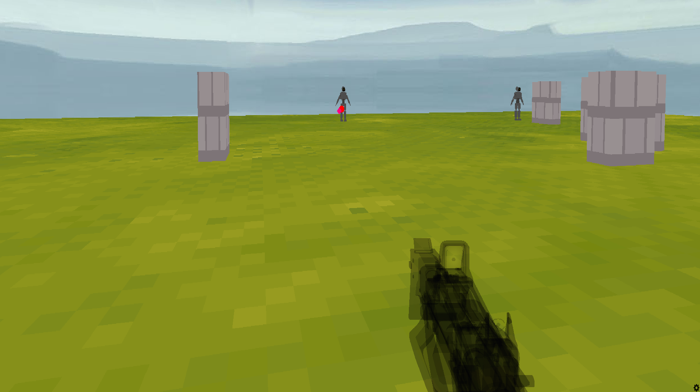

#  Shooter (FPS Game)

> **Author:** Eugen Sulakov  
> *This is a robot shooter I originally wrote for my son about a year ago. At the time, everything was crammed into one long spaghetti script. Recently I decided to clean it up and turn it into a structured project.*

##  What is this?

A small 3D first-person shooter game written in **Python** using the **Ursina Engine**.  
The player controls a robot, shoots enemy bots, and progresses through levels.  
Each new level adds more enemies, and the game ends in victory after level 5.

##  Project Architecture

The code is modular and separated into logical components:

| File             | Purpose                                      |
|------------------|----------------------------------------------|
| `main.py`        | entry point                                  |
| `game_manager.py`| handles game lifecycle and restarts          |
| `shooter.py`     | player logic and level progression           |
| `enemy.py`       | enemy behavior                               |
| `bullet.py`      | bullet movement and collision handling       |
| `hud.py`         | user interface (text, buttons, messages)     |
| `scene.py`       | builds terrain, walls, and level boundaries  |

##  Gameplay

- Move: `WASD`, Jump: `Space`
- Shoot: `Left Mouse Button`
- Win: survive all 5 levels
- Lose: if lives reach 0
- Press `Escape` to quit the game
- You can **restart** the game without restarting the app

##  Textures & Audio

All textures, models, and sound effects are from **free and open sources**:

- [opengameart.org](https://opengameart.org)
- [freesound.org](https://freesound.org)
- Built-in Ursina assets

Please replace or license assets properly if reusing this project.

##  How to Run

You’ll need Python 3.10+ and `ursina` installed.